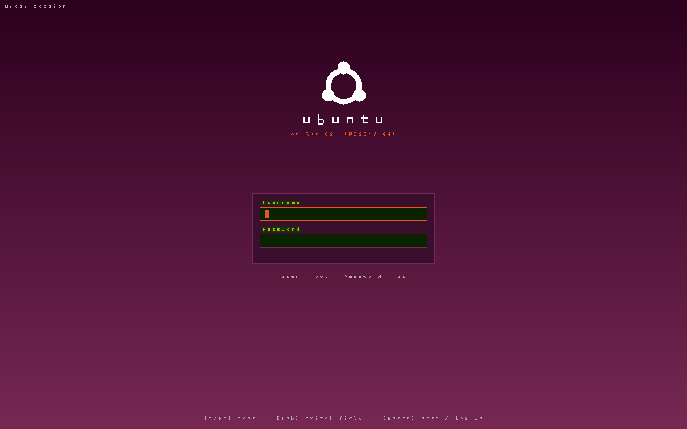
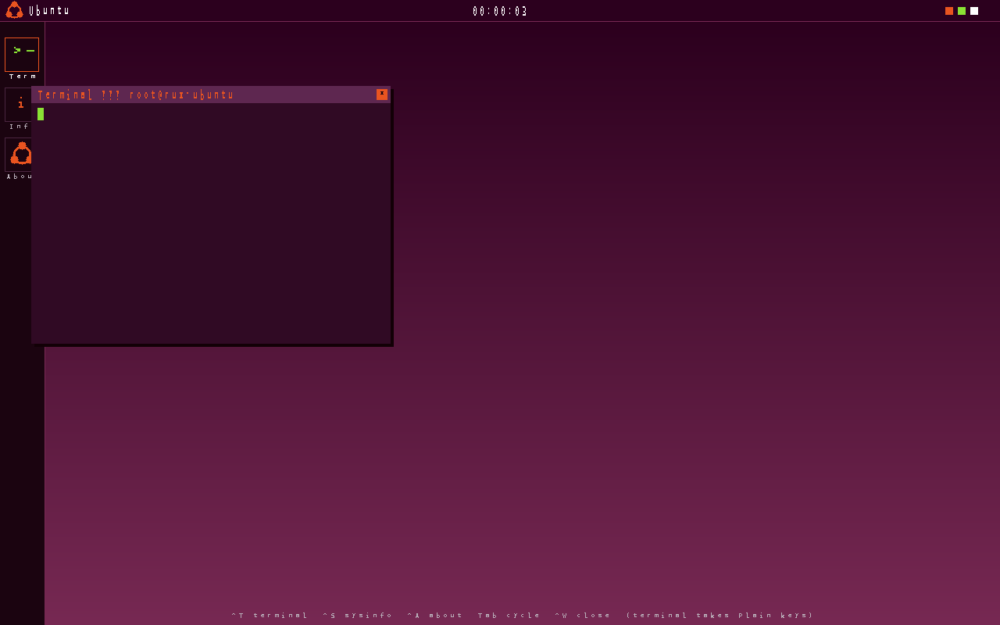
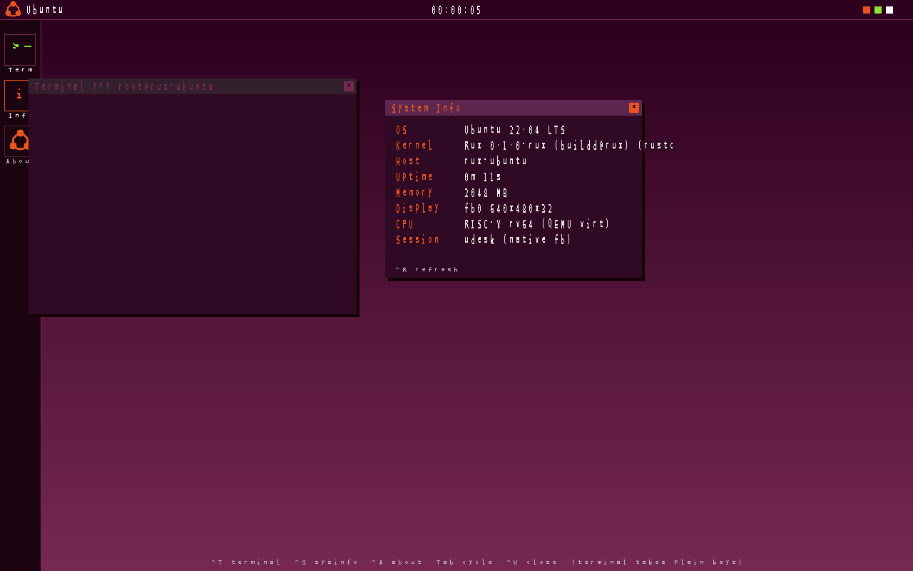
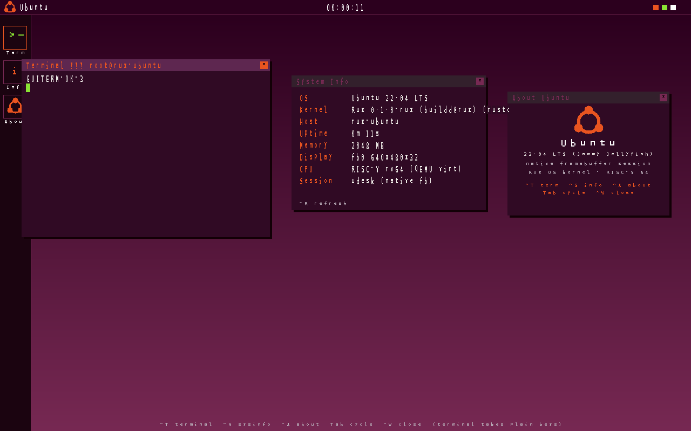

# Rux

<div align="center">

**A Linux-like OS kernel entirely written in Rust**

[](https://www.rust-lang.org/)
[](LICENSE)
[](https://github.com/rust-osdev/rust-embedded)
[](#-test-status)
[](#-formal-verification)
[](docs/architecture/structure.md)

**Platforms: RISC-V 64-bit (RV64GC, primary) · x86_64 (q35)**

</div>

---

## 🖥️ Rux Runs Ubuntu

**A complete Ubuntu 22.04 userland — glibc dynamic binaries, real shells, D-Bus, a graphical desktop session, Xorg rendering X client windows, and an interactive xterm — boots on the Rux kernel today, on both riscv64 and x86_64 (amd64).**

| | |
|---|---|
|  |  |
| *Login screen (native framebuffer session)* | *Desktop with dock, top panel and windows* |
|  |  |
| *System Info — kernel row shows the Rux identity* | *Terminal running a real `/bin/dash` shell — real commands, real output* |

What is running in these screenshots, all on the Rux kernel:

- **Real Ubuntu 22.04 rootfs** (glibc, ld.so, dynamic ELF loading with PT_INTERP)
- **Graphical session** on the virtio-GPU framebuffer (`/dev/fb0` mmap), with
  keyboard and mouse input through virtio-input → evdev — the desktop is
  operable directly from the emulator window (click fields, dock, title bars,
  close boxes; type in the terminal)
- **A real shell** executing real commands inside the Terminal window
  (fork / exec / pipes / wait on Ubuntu's own `/bin/dash`)
- **Interactive bash, D-Bus (system + session bus) end to end**, pty, SysV IPC,
  POSIX signals with full nesting semantics, 4-CPU SMP with cross-core TLB
  shootdowns
- **Linux ABI by design**: `uname` and `/proc/version` intentionally report
  Linux-compatible strings — that identity is what lets unmodified
  Ubuntu/glibc binaries run without patches; the desktop's System Info
  panel surfaces the Rux identity over the same data
  (`Rux 0.1.0-rux (buildd@rux) (rustc …) #1 SMP`)
- **Xorg runs**: the X server completes full initialization on Rux —
  screen, all extensions, evdev keyboard/mouse devices, InputThread, and
  the `/tmp/.X11-unix/X0` socket (3/3 cold boots) — and the X client ↔
  Xorg request path is fully working (`XOpenDisplay(:0)` + `XSync`
  succeed). One `recvmsg` ABI fix unlocked the dispatch path: the kernel
  now zeroes `msg_controllen` when a message carries no control data —
  previously the caller's buffer capacity was left in the msghdr, and
  Xorg walked garbage cmsgs in a non-advancing, 100%-CPU loop
- **Input reaches X clients end to end**: keyboard, pointer and button
  events injected through QEMU reach a raw X11 protocol client as the
  exact KeyPress/KeyRelease, MotionNotify and ButtonPress sequence
  (verified by `test/xinput_probe.c` against Xorg 1.21 with
  xf86-input-evdev)
- **xterm is a working interactive terminal**: it opens its pty through
  `/dev/ptmx` and the shell inside — bash and dash — stays alive
  (unlocked by Linux-exact pty semantics: TIOCGPTPEER, the
  corrected TIOCGPTN ioctl number, TIOCGPGRP foreground-pgrp rules,
  ENOTTY for unknown ioctls)
- **X client windows render to the screen**: a self-written X client maps
  a window and its pixels reach the display, verified by an fbmap probe
  counting non-black framebuffer pixels (21,384, stable across 2 runs)
- **A full GNOME session survives**: gnome-session, gnome-shell, the
  gsd settings daemons, gnome-keyring-d and dconf-service all stay
  alive through the session — after the D-Bus system-bus blocker was
  fixed (filesystem AF_UNIX sockets are now keyed by inode identity,
  so `/run` / `/var/run` aliases name the same socket, and a full
  listen backlog blocks like Linux instead of returning ECONNREFUSED).
  On-screen GNOME bring-up continues (see the
  [Roadmap](docs/progress/roadmap.md))

### Try it

```bash
make ubuntu-image    # build the Ubuntu GUI disk image (work/ubuntu-gui.img)
make ubuntu-run      # boot it: native SDL window + keyboard + mouse, 4 CPUs, MTTCG
                     # boot-to-login ~4.5s (THREAD=single restores the deterministic mode)
                     # login: root / rux   (Ctrl-S SysInfo, Ctrl-A About, Tab focus, Ctrl-W close)
```

Automated pixel-level verification (23 checks per boot: login → wrong password
→ desktop → apps → real command execution → window close → panic scan):

```bash
python3 test/ubuntu-gui/verify.py --runs 2 --smp 4
```

---

## 🤖 AI Generation Statement

**This project's code is developed with AI assistance (Claude Code + Opus4.6/GLM5.1/Minimax2.7).**

- Uses Anthropic Claude Code CLI tool for assisted development
- Follows POSIX standards and maintains 100% Linux ABI compatibility
- Aims to explore the possibilities and limitations of **AI-assisted OS kernel development**

---

## 🎯 Project Goals

### ⚠️ Core Principle: Full POSIX/ABI Compatibility

**Core Objective**: A Linux-compatible OS kernel written in Rust

- ✅ **100% POSIX Compatible** - Full compliance with POSIX standards
- ✅ **Linux ABI Compatible** - Can run native Linux userspace programs directly
- ✅ **System Call Compatible** - Uses Linux system call numbers and interfaces
- ✅ **Filesystem Compatible** - Supports ext4 and other Linux filesystems
- ✅ **ELF Format Compatible** - Executable format identical to Linux

**Design Philosophy**:
- External interfaces must be 100% compatible with Linux
- Internal implementation can use better designs when it doesn't affect compatibility
- Welcoming improvements that maintain Linux ecosystem compatibility

---

## 📊 Project Status

| Metric | Value | Details |
|--------|-------|---------|
| **Lines of Code** | ~164,900 lines | [Code Structure](docs/architecture/structure.md) |
| **Source Files** | 306 files (303 Rust + 3 ASM) | [Project Structure](docs/architecture/structure.md) |
| **Kernel Unit Tests** | 60 files, 985 cases (985/985 green after suite repair) | [Unit Test Report](docs/test/unit-test-report.md) |
| **Formal Verification** | 4 tools, 1,116+ test functions; 157 Kani proofs | [Verification Design](docs/development/formal-verification.md) |
| **Smoke Tests** | 15 tests (all passing) | [Testing Guide](docs/test/testing.md) |
| **Linux LTP** | 1,838 official tests; 6 fix rounds (~90 files, ~4,000 lines) | [Testing Guide](docs/test/testing.md) |
| **LTP Full Sweeps** | PASS 35 → 524 → 659 → 677 → 602 (r1–r5, 1,869 tests each); round-6 rescan in progress | [Roadmap](docs/progress/roadmap.md) |
| **Platform Support** | RISC-V 64-bit + x86_64 (q35), 4-CPU SMP | [Roadmap](docs/progress/roadmap.md) |
| **Syscall Numbers** | 345 dispatched | [Roadmap](docs/progress/roadmap.md) |
| **Ubuntu Userland** | Ubuntu 22.04 riscv64 boots: graphical session, Xorg + X client windows, interactive xterm, bash, D-Bus | [Screenshots](#️-rux-runs-ubuntu) |
| **Memory** | Swap active: 2,064 MiB anonymous working set paged through 256 MB swap, verified | [Roadmap](docs/progress/roadmap.md) |
| **Boot Performance** | MTTCG default (`thread=multi`): boot-to-login ~4.5s, 2.1x faster | [Roadmap](docs/progress/roadmap.md) |

**Module Distribution**:
- Filesystem (fs/): 39,951 lines (24.2%)
- System Calls (syscall/): 24,204 lines (14.7%)
- Network Stack (net/): 16,214 lines (9.8%)
- Architecture (arch/): 11,999 lines (7.3%)
- Device Drivers (drivers/): 11,981 lines (7.3%)
- Memory Management (mm/): 11,513 lines (7.0%)
- Process Management (process/): 10,857 lines (6.6%)
- Unit Tests (tests/): 9,814 lines (6.0%)
- Top-level: 7,468 lines (4.5%)
- Process Scheduling (sched/): 6,392 lines (3.9%)
- IPC (ipc/): 4,385 lines (2.7%)
- Sync Primitives (sync/): 3,504 lines (2.1%)
- Diagnostics (dfx/): 2,595 lines (1.6%)
- Interrupt (interrupt/): 1,802 lines (1.1%)
- IO_uring (io_uring/): 1,167 lines (0.7%)
- Security (security/): 559 lines (0.3%)
- Module Loader (module/): 476 lines (0.3%)

---

## 🚀 Quick Start

### Prerequisites

```bash
# Rust toolchain (nightly recommended)
rustc --version
cargo --version

# QEMU system emulator
qemu-system-riscv64 --version

# RISC-V target (primary)
rustup target add riscv64gc-unknown-none-elf

# x86_64 target (optional)
rustup target add x86_64-unknown-none
```

### Build and Run

```bash
# === Ubuntu desktop (highlight) ===
make ubuntu-image    # build the Ubuntu 22.04 GUI disk image
make ubuntu-run      # boot Ubuntu in a native window (4 CPUs, keyboard + mouse)

# === Musl/minimal userland ===
# Build kernel
make build

# Build userspace programs (shell, apps, toybox)
make user

# Build Rootfs image
make rootfs

# Run kernel (default shell)
make run

# Run unit tests
make test

# Run formal verification (sync check + proptest)
make verify

# Run Kani symbolic verification (all inputs, SAT/SMT)
make kani

# Run Miri UB detection
make miri

# Run SPIN concurrency model checking
make spin
```

For detailed instructions: [Getting Started Guide](docs/guides/getting-started.md)

---

## 🏆 Boot Log (Ubuntu desktop, `-smp 4`)

```
Module            Description                        Status
----------------  --------------------------------   --------
console:          UART ns16550a driver               [ok]
trap:             stvec handler installed            [ok]
trap:             ecall syscall handler              [ok]
mm:               Sv39 3-level page table            [ok]
mm:               satp CSR configured                [ok]
mm:               buddy allocator order 0-12         [ok]
mm:               heap region 128MB @ 0x80a00000     [ok]
mm:               slab allocator 4MB                 [ok]
boot:             FDT/DTB parsed                     [ok]
boot:             cmd: root=/dev/vda rw init=...     [ok]
mm:               linear mapping 2048 MB             [ok]
mm:               vmemmap mapping initialized        [ok]
mm:               layout: kernel=0x80200000-0x80a0   [ok]
mm:               layout: heap=0x80a00000-0x88a000   [ok]
mm:               524288 page descriptors            [ok]
mm:               zone allocator initialized         [ok]
memblock:         total 2048MB, available 1841MB     [ok]
mm:               device mappings created            [ok]
irq:              irq_desc array initialized         [ok]
intc:             PLIC @ 0x0C000000                  [ok]
intc:             IRQ domain + chip registered       [ok]
ipi:              SSIP software IRQ + bitmap multi   [ok]
console:          UART interrupt-driven RX           [ok]
bio:              buffer cache layer                 [ok]
fs:               ext4 driver loaded                 [ok]
fs:               ramfs mounted /                    [ok]
fs:               procfs initialized                 [ok]
fs:               procfs mounted /proc               [ok]
cgroup:           v2 unified hierarchy init          [ok]
cgroup:           cgroup2 mounted /sys/fs/cgroup     [ok]
driver:           virtio-blk PCI x1                  [ok]
driver:           GenDisk registered                 [ok]
fs:               ext4 mounted /                     [ok]
fs:               procfs remounted /proc             [ok]
mm:               swap 256 MB tail carve             [done]
driver:           virtio-net x1                      [ok]
vdso:             clock_gettime fast path            [ok]
security:         capability LSM initialized         [ok]
sched:            CFS scheduler v1                   [ok]
sched:            runqueue per-CPU                   [ok]
sched:            PID allocator init                 [ok]
sched:            idle task (PID 0)                  [ok]
mm:               kswapd reclaim thread              [ok]
dfx:              diagnostic subsystem               [ok]
ipc:              System V + POSIX MQ                [ok]
smp:              4 CPUs online (boot hart 0)        [ok]
softirq:          ksoftirqd per-CPU threads          [ok]
dfx:              khungtaskd hung-task detector      [ok]
trap:             sie.SEIE enabled                   [ok]
driver:           virtio-gpu probed                  [ok]
gpu:              1280x800 32bpp framebuffer         [ok]
fs:               devfs mounted /dev                 [ok]
driver:           /dev/fb0 registered                [ok]
fs:               tmpfs mounted /dev/shm             [ok]
fs:               tmpfs mounted /run                 [ok]
driver:           evdev /dev/input/event0            [ok]
driver:           evdev /dev/input/event1            [ok]
driver:           virtio-keyboard                    [ok]
driver:           virtio-tablet                      [ok]
init:             loading /sbin/init                 [ok]
init:             ELF loaded to user space           [ok]
init:             init task (PID 1) enqueued         [ok]
Welcome to Rux OS (RISC-V 64)
- mrsh (POSIX shell) | A minimal POSIX-compatible shell

udesk-init: boot ok
udesk-init: warmup st=0
[udesk] fb 1280x800
[udesk] login screen up
```

---

## 📁 Project Structure

```
Rux/
├── kernel/                 # Kernel source (~164,900 lines)
│   ├── src/
│   │   ├── fs/           # Filesystem (39,951 lines)
│   │   │   ├── ext4/     # ext4 filesystem
│   │   │   ├── jbd2/     # JBD2 journaling layer
│   │   │   ├── devfs/    # devfs device filesystem
│   │   │   └── procfs/   # procfs process filesystem
│   │   ├── arch/         # Architectures: riscv64 + x86_64
│   │   │   ├── mm/       # Arch-specific MM (pt, fixmap, ASID, page fault)
│   │   │   ├── boot.S    # MMU trampoline, VMA/LMA linking
│   │   │   ├── trap.S    # PtRegs save/restore, ret_from_fork
│   │   │   └── uaccess.S # User memory access assembly
│   │   ├── drivers/      # Device drivers (11,981 lines)
│   │   │   ├── gpu/      # GPU/framebuffer drivers
│   │   │   ├── input/    # Input device drivers
│   │   │   ├── virtio/   # VirtIO devices (blk/net/gpu/input)
│   │   │   └── net/      # Network devices
│   │   ├── mm/           # Memory management (11,513 lines)
│   │   │   ├── Zone allocator (DMA/DMA32/NORMAL/MOVABLE)
│   │   │   ├── vmemmap, buddy, slab, PCP, memblock
│   │   │   ├── VMA, mm_struct, page fault, COW
│   │   │   └── rmap, hugepage, meminfo
│   │   ├── tests/        # Unit tests (60 files, 985 cases)
│   │   ├── syscall/      # System calls (24,204 lines, 345 syscalls)
│   │   ├── ipc/          # IPC (4,385 lines) — System V, POSIX MQ
│   │   ├── net/          # Network stack (16,214 lines)
│   │   ├── sched/        # Process scheduling (6,392 lines)
│   │   │   ├── CFS, RT (FIFO/RR), Deadline (EDF+CBS), Idle
│   │   ├── process/      # Process management (10,857 lines)
│   │   ├── sync/         # Sync primitives (3,504 lines)
│   │   ├── interrupt/    # Interrupt subsystem (1,802 lines)
│   │   └── dfx/          # Diagnostics/DFX (2,595 lines)
│   └── build.rs          # Build script
├── userspace/            # Userspace programs
│   ├── mrsh/             # mrsh (minimal POSIX shell, musl libc)
│   ├── apps/             # GUI applications (desktop, calculator, clock, vshell)
│   ├── libs/             # Userspace libraries (gui)
│   ├── tests/smoke_test/ # Smoke tests (15 tests, all passing)
│   ├── linux-ltp/        # Official LTP tests (1,838)
│   └── toybox/           # Toybox (200+ command line tools)
├── toolchain/            # Toolchain (musl libc)
├── docs/                 # 📚 Documentation center
├── test/                 # Test scripts
└── Cargo.toml            # Workspace configuration
```

Detailed structure: [Project Structure Documentation](docs/architecture/structure.md)

---

## ✨ Key Features

### Implemented Features

- **Process Management**: fork/execve/wait4/signal handling/CFS scheduler/clone flags/gettid
- **Memory Management**: Sv39 page table/Zone allocator/vmemmap/PCP/COW/Demand paging/ASID/MAP_PRIVATE COW/Swap (active, >2 GiB verified)/LRU page cache/OOM killer
- **Filesystem**: ext4/procfs/devfs/ramfs/sysfs (mdev-compatible)/JBD2 journaling/crash recovery
- **IPC**: System V semaphores/message queues/shared memory, POSIX message queues
- **Device Drivers**: VirtIO-blk/net/gpu/input, framebuffer, evdev, goldfish RTC, PCI ECAM rescan/hotplug
- **Network Stack**: TCP/UDP/IPv4/ARP/Socket API/AF_PACKET + raw sockets/netlink/udhcpc bring-up/IO_uring
- **SMP Multi-core**: 4-core support/load balancing/IPI/per-CPU idle tasks
- **Linux-Style Boot**: MMU trampoline/VMA-LMA linking/PtRegs at stack top
- **System Lifecycle**: reboot(2) with CAD semantics, shutdown(8) cascade, Ctrl-Alt-Del, SBI poweroff
- **Diagnostics**: core dumps readable by host gdb, dfx memwatch heap/page call-site accounting
- **Security**: Capabilities/LSM framework/signal/file/IPC permission checks
- **POSIX Timers**: timer_create/settime/gettime/delete, setitimer/getitimer, timerfd

### System Calls

Supports 345 Linux system calls, including:
- File: openat/close/read/write/readv/writev/pread64/pwrite64/lseek/fstat/getdents64/mkdirat/rmdir/unlinkat/sendfile/statfs/copy_file_range/statx
- Process: fork/execve/wait4/exit/getpid/getppid/gettid/kill/clone/sched_yield/prctl/getrusage
- Memory: brk (expand+shrink)/mmap/munmap (MAP_PRIVATE COW)/mprotect/mremap/madvise/msync
- Signal: sigaction/sigprocmask/sigreturn/sigaltstack/sigpending/sigtimedwait
- Network: socket/bind/listen/accept/connect/sendto/recvfrom/sendmsg/recvmsg
- IPC: pipe/pipe2/dup/dup3/select/poll/epoll/eventfd/futex/shmget/shmat/shmdt/msgget/msgsnd/msgrcv/semget/semop/mq_open/mq_send/mq_receive
- Async I/O: io_uring_setup/io_uring_enter/io_uring_register
- Timers: timer_create/timer_settime/timer_gettime/timer_delete/timer_getoverrun/timerfd_create/timerfd_settime/timerfd_gettime/setitimer/getitimer

---

## 📚 Documentation

### Core Documentation

- **[Getting Started](docs/guides/getting-started.md)** - Up and running in 5 minutes
- **[Roadmap](docs/progress/roadmap.md)** - Phase planning and current status (X11 milestone: Xorg, X client windows, interactive xterm)
- **[Project Structure](docs/architecture/structure.md)** - Source code organization
- **[Design Principles](docs/architecture/design.md)** - POSIX compatibility and Linux ABI alignment

### Architecture Documentation

- **[RISC-V Architecture](docs/architecture/riscv64.md)** - RV64GC support details
- **[Boot Process](docs/architecture/boot.md)** - MMU trampoline, VMA/LMA linking, page table init
- **[Memory Management](docs/architecture/memory.md)** - Zone allocator, vmemmap, COW, demand paging
- **[Lock Ordering](docs/architecture/lock-ordering.md)** - Kernel lock hierarchy and nesting rules
- **[Changelog](docs/progress/changelog.md)** - Version history and update records

### Development Guides

- **[Development Workflow](docs/guides/development.md)** - Contributing code and development standards
- **[Boot Process](docs/architecture/boot.md)** - From OpenSBI to kernel boot
- **[User Programs](docs/archive/user-programs.md)** - ELF loading and execve (archived)
- **[Formal Verification](docs/development/formal-verification.md)** - 4-layer verification strategy

### Test Reports

- **[Unit Test Report](docs/test/unit-test-report.md)** - Kernel unit test cases (60 files, 985/985 green after the suite repair)
- **[Formal Verification Report](docs/test/formal-verification-report.md)** - proptest-based invariant tests

---

## 🧪 Test Status

**Total: 4,115 test cases + 161 formal verification proofs**

| Test Suite | Cases | Run Command | Environment |
|------------|-------|-------------|-------------|
| **Kernel Unit Tests** | 985 | `make test` | QEMU (no_std, custom harness) |
| **Formal Verification** | 1,116 | `make verify` | Host (std, proptest) |
| **Linux LTP** | 1,838 | `make run` → `/test/linux-ltp/run_ltp.sh` | QEMU |
| **Smoke Tests** | 15 | `make run` → `/test/smoke_test` | QEMU |
| **Kani Proofs** | 157 | `make kani` | Host (Kani/CBMC, all-input symbolic) |
| **SPIN Models** | 4 | `make spin` | Host (SPIN/Promela, concurrency) |
| **Miri UB Detection** | - | `make miri` | Host (Miri, undefined behavior) |

### Kernel Unit Tests (985 cases, 60 files — 985/985 green after the suite repair)
- **Framework**: Custom `no_std` harness (`test_pass`, `test_fail`, `test_assert!`)
- **Coverage**: Memory management, process management, filesystem, network, drivers, syscalls, IPC, scheduler, synchronization
- **Report**: [Unit Test Report](docs/test/unit-test-report.md)

### Formal Verification

A 4-layer verification strategy covering ~15% of the kernel's unsafe TCB:

| Layer | Tool | What It Verifies | Cases |
|-------|------|-----------------|-------|
| **L1: Property Testing** | proptest | Data structure invariants (randomized) | 1,088 |
| **L2: Symbolic Verification** | Kani | Core unsafe safety (all inputs, SAT/SMT) | 157 harnesses |
| **L3: Concurrency** | SPIN/Promela | Deadlock-free, no lost wakeup, preempt balance | 4 models |
| **L4: UB Detection** | Miri | Undefined behavior in test code | CI gate |

- **Design**: [Formal Verification Design](docs/development/formal-verification.md)
- **proptest Report**: [Formal Verification Report](docs/test/formal-verification-report.md)

#### Kani Symbolic Verification (157 harnesses, 22 modules)

Proves properties hold for ALL possible inputs via SAT/SMT solvers:
- **mm** (18): slab, page_flags, buddy_alloc, refcount, vma
- **sync** (2): spinlock try_lock/unlock
- **arch** (17): pt_regs, memory_layout, asid
- **process** (16): exit_status, pid, task_state, cred
- **signal** (17): signal bitmap, sigpending
- **drivers** (17): pci, virtio, netdev, input
- **ipc** (5): ipc_id
- **fs** (20): dev_t, permission, stat, inode
- **net** (15): checksum, ethernet, tcp_state
- **sched** (12): rt_bitmap, class
- **interrupt** (12): preempt, softirq
- **security** (9): capability bitmask
- **errno** (5): enum consistency

#### SPIN Concurrency Models (4 models, 8 LTL properties)

Verifies lock ordering and concurrency safety:
- **futex_wait_wake**: No lost wakeup, no spurious sleep
- **lock_ordering**: No deadlock cycle across 5 lock levels
- **interrupt_preempt**: preempt_count bounded, no underflow
- **sched_enqueue_dequeue**: nr_running consistency

#### proptest (1,088 cases, 98 modules)
- **Framework**: [proptest](https://crates.io/crates/proptest) 1.5 (property-based, randomized, 256 cases per test)
- **Subsystems**: mm (252), fs (240), net (123), security (38), interrupt (38), sync (50), sched (70), signal (30), drivers (34), ipc (22), process (39), arch (13), errno (8)
- **Report**: [Formal Verification Report](docs/test/formal-verification-report.md)

### Smoke Tests (15 tests, all passing)
- **Coverage**: File I/O, process management, memory, signals, O_CLOEXEC, sendfile, wait4, process groups, setsid, credentials, readv/writev, gettid, pwrite64, dup3, kill, statfs, sched_yield

### Linux LTP Test Suite (1,838 tests)
- **LTP Version**: 20240524
- **Compile Rate**: 101% (musl libc cross-compilation)
- **Coverage**: Syscalls (1,378), memory (108), containers (46), filesystem (29), security (24), scheduler (23), IO (19)
- **Full sweeps**: 1,869-test guest-side runner, five scans so far — PASS 35 → 524 → 659 → 677 → 602 (r1–r5); the r5 dip (+72 TIMEOUTs, tmpfs `/tmp` exhaustion) drove the round-6 fix batch (~90 files, ~4,000 lines total across rounds), rescan in progress

---

## 🤝 Contributing

Contributions are welcome! Please check the [Roadmap](docs/progress/roadmap.md) for tasks that need help.

### Development Standards

- Follow [Conventional Commits](https://www.conventionalcommits.org/) specification
- Refer to [Development Workflow](docs/guides/development.md) for development standards

**Core Principles**:
- ✅ Strictly follow POSIX standards and Linux ABI
- ✅ External interfaces must be 100% compatible with Linux
- ✅ Internal implementation can use any design approach
- ✅ Welcoming any improvements that maintain compatibility

---

## 📄 License

MIT License - See [LICENSE](LICENSE) for details

---

## 🙏 Acknowledgments

This project is inspired by:

- [Linux Kernel](https://www.kernel.org/)

---

<div align="center">

**Made with ❤️ and Rust + AI**

[Project Home](https://github.com/topkernel/rux) • [Issue Tracker](https://github.com/topkernel/rux/issues)

</div>
